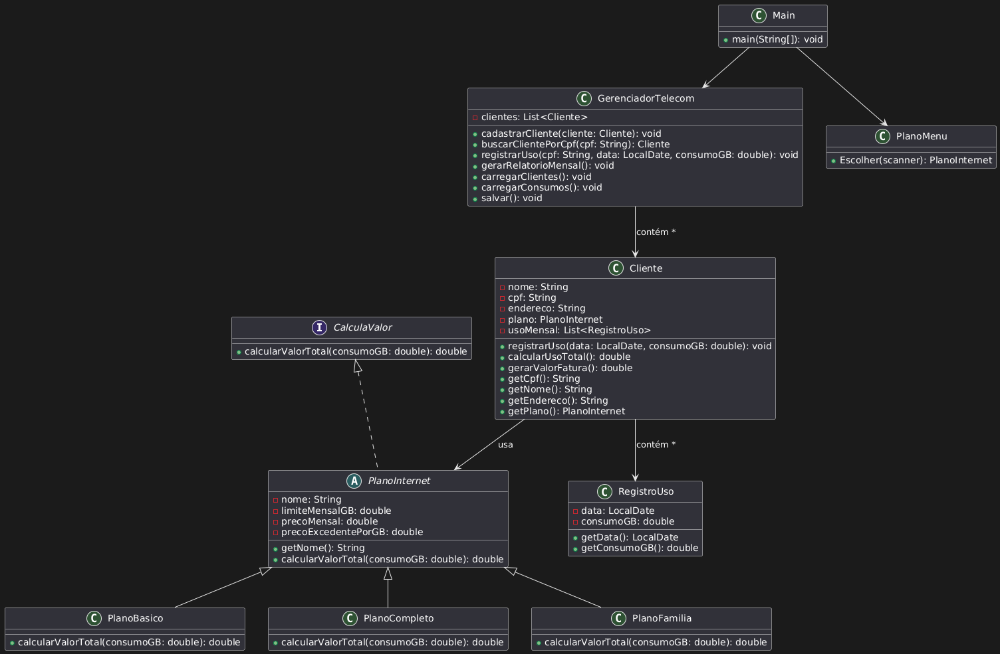

# 📶 BandTrack - Sistema de Gerenciamento de Planos de Internet

Projeto desenvolvido para a disciplina de Programação Orientada a Objetos (POO), com foco em boas práticas, uso de herança, polimorfismo, abstrações, tratamento de exceções e persistência de dados.

## 📚 Sobre o Projeto

O **BandTrack** é um sistema de linha de comando que simula uma loja de planos de internet, permitindo:

- Cadastrar clientes com diferentes tipos de planos;
- Registrar o consumo mensal de cada cliente;
- Calcular automaticamente o valor da fatura baseado no consumo;
- Gerar relatórios mensais;
- Salvar e carregar os dados automaticamente via arquivos `.csv`.

## 🧱 Estrutura do Projeto

```bash
src/
│
├── main/                  # Contém o ponto de entrada do sistema
│   └── Main.java
│
├── model/                 # Contém as classes de domínio
│   ├── Cliente.java
│   ├── PlanoInternet.java
│   ├── PlanoBasico.java
│   ├── PlanoCompleto.java
│   ├── PlanoFamilia.java
│   ├── RegistroUso.java
│   └── [Interface usada].java
│
├── service/               # Camada de serviço
│   └── GerenciadorTelecom.java
│
└── view/                  # Interação com o usuário
    └── PlanoMenu.java
```

## 🧩 Diagrama UML do projeto 



## 📦 Descrição das Classes Principais

- **Cliente**  
  Guarda os dados do cliente (nome, CPF, endereço) e também o plano contratado junto com os registros de consumo. Protege esses dados usando encapsulamento e usa o método calcularValorTotal do plano para calcular a fatura, utilizando o polimorfismo.

- **PlanoInternet (classe abstrata)**  
  Reúne os atributos comuns a todos os planos, como nome, limite de dados, preço mensal e custo extra por GB. Define o método calcularValorTotal que cada plano específico precisa implementar. Isso facilita criar novos planos sem mexer no código que já existe.
    > Nesta implementação, a interface `CalculaValor` não era obrigatória, já que a classe abstrata `PlanoInternet` já define o método `calcularValorTotal`.
    > Porém, usar a interface ajuda a deixar o código mais organizado e preparado para crescer. Se no futuro o sistema precisar de outros tipos de planos ou objetos que calculam valores de formas diferentes, a interface garante que todos sigam o mesmo padrão.  
    > Isso facilita manter o código, adicionar coisas novas sem bagunçar o que já está pronto, e deixa tudo mais flexível.
- **PlanoBasico, PlanoCompleto, PlanoFamilia**  
  Especializações de `PlanoInternet` que implementam a lógica específica de cobrança para cada tipo de plano, sobrescrevendo o método `calcularValorTotal`.

- **RegistroUso**  
  Registra o consumo diário ou mensal de um cliente, armazenando a data e a quantidade consumida em GB.

- **GerenciadorTelecom**  
  Responsável pela gestão dos clientes e seus consumos, incluindo cadastro, busca por CPF, registro de uso, geração de relatórios e persistência dos dados em arquivos CSV.

- **PlanoMenu**  
  Classe auxiliar que apresenta o menu para seleção de planos no momento do cadastro do cliente, facilitando a interação com o usuário.

- **Main**  
  Ponto de entrada da aplicação, que apresenta o menu principal, lê a entrada do usuário e executa as operações solicitadas.

